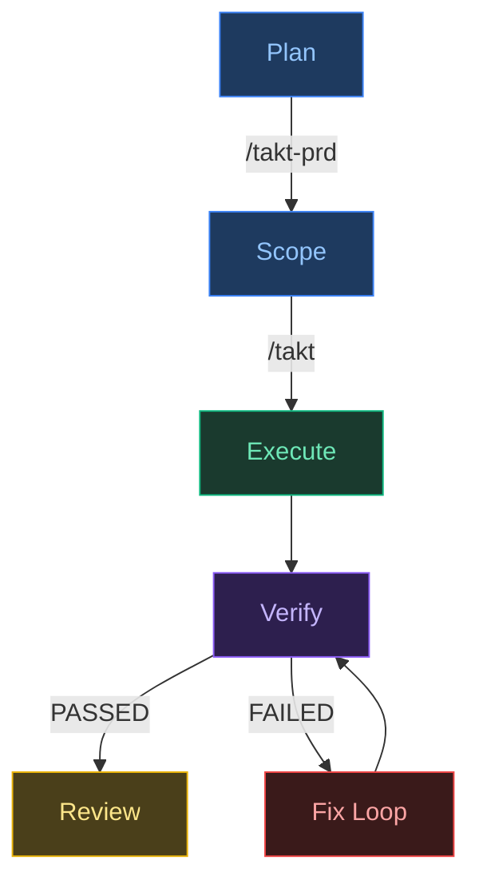
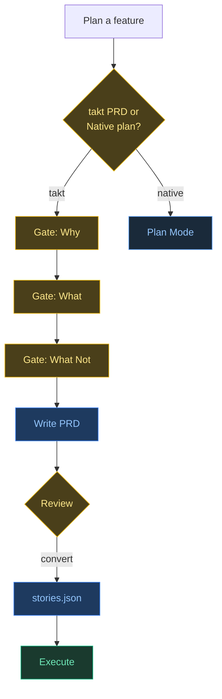
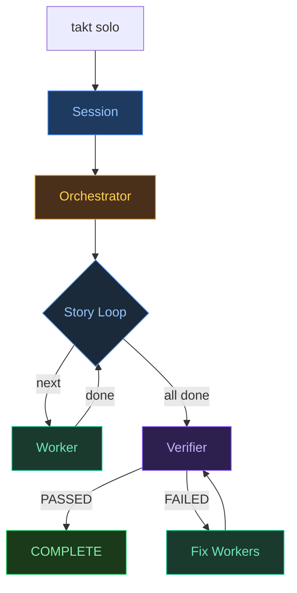
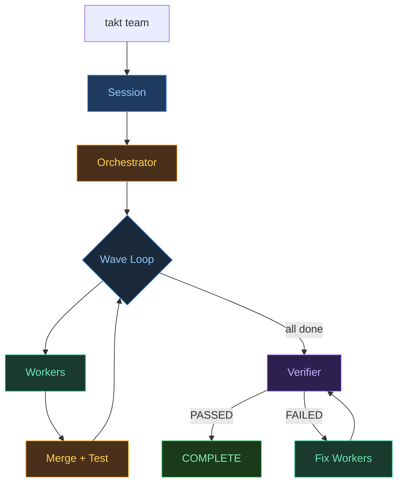

# takt

Enterprise-grade development workflows for AI agents. Four modes that mirror real agile delivery: sprint execution, parallel teams, structured debugging, and retrospectives — with hidden scenario-based verification that prevents agents from gaming their own tests.

Named after the Swedish/German word for "beat, pace, rhythm" — the same concept used in lean manufacturing and agile planning to set a sustainable delivery cadence. takt brings that discipline to autonomous AI development.

## Why takt?

Most AI coding tools treat development as a single prompt-response cycle. Real software delivery doesn't work that way. takt is built on patterns from orchestrating 50+ person programs across 10+ teams:

- **Stories, not prompts.** Work is scoped into user stories with acceptance criteria — the same artifact that drives human sprint planning.
- **Wave-based parallelism.** Dependencies are analyzed upfront, stories grouped into waves, and parallel agents execute within each wave — just like a real team coordinating across workstreams.
- **Fresh context per story.** Each story gets a clean agent instance, avoiding the context pollution that derails long sessions. Memory persists through git history, workbooks, and the PRD itself.
- **Hidden scenario verification.** An independent QA agent checks implementations against hidden BDD scenarios that workers never see — like a QA team that never shows developers what they're testing. Workers can't game the tests because they don't know the tests exist.
- **Verify-fix loops.** When verification fails, the system generates behavioral bug tickets (not scenario details) and spawns fresh workers to fix them. Up to 3 cycles, maintaining strict information isolation throughout.
- **Retrospectives that compound.** After each run, patterns are extracted from workbooks and tracked across executions. Recurring issues surface as alerts, not surprises.

## How It Works

takt runs natively inside Claude Code. There is no CLI binary or bash script — you interact with it by typing phrases in Claude Code.



### Planning Flow

When planning a feature, takt intercepts plan mode to offer a structured PRD flow with gated checkpoints:



1. **Plan** — Discuss the feature with Claude. Say "Create the PRD" and Claude generates a structured requirements document using `/takt-prd` with gated checkpoints (Why → What → What Not → Review).
2. **Scope** — Say "Convert to stories.json" and Claude converts the PRD into two files: `stories.json` (visible to workers) and `.takt/scenarios.json` (hidden BDD scenarios visible only to the verifier).
3. **Execute** — Say "takt solo" or "takt team". Workers implement stories against acceptance criteria. They never see the hidden scenarios.
4. **Verify** — After all stories pass, an independent verifier checks the implementation against hidden scenarios. Failed scenarios become behavioral bug tickets. Fresh workers fix the bugs without seeing scenarios. Up to 3 verify-fix cycles.
5. **Review** — Say "takt retro" and Claude analyzes workbooks from the run, identifies patterns, and tracks recurring issues across executions.

## Information Isolation

takt enforces strict information boundaries between agents. This is the key architectural property that prevents workers from gaming verification.

```
/takt command (human reviews both files)
    ├── stories.json        → orchestrator → workers (implement features)
    └── .takt/scenarios.json → verifier ONLY (QA verification)
                                    │
                              100%? → DONE
                              <100%?→ bugs.json → fresh workers (fix)
                                                      │
                                                 re-verify (max 3 cycles)
```

| File | Orchestrator | Worker | Verifier | Fix Worker |
|------|-------------|--------|----------|------------|
| `stories.json` | reads | reads | never | never |
| `.takt/scenarios.json` | passes path only | **never** | reads | **never** |
| `bugs.json` | reads (routing) | never | writes | reads |

**How it's enforced:**
- Workers have an explicit rule: "NEVER read files in `.takt/`"
- Orchestrators have an explicit rule: "NEVER read `.takt/scenarios.json` content — only pass the file path to the verifier"
- Bug tickets describe behaviors ("Form accepts empty email without validation error"), never scenario details ("SC-003 Given/When/Then failed")
- Each agent gets a fresh context (Ralph Wiggum pattern) — no information leaks between agent instances

This is prompt-level architectural isolation, not cryptographic enforcement. The same principle that makes human QA effective: devs don't see the test plan, so they build to the spec rather than to the tests.

## Modes

### takt solo — Sprint Execution

Single orchestrator, one story at a time. The session agent reads `stories.json`, spawns a background orchestrator with all context embedded, and monitors progress. The orchestrator picks the next incomplete story, spawns a fresh worker agent to implement it, verifies acceptance criteria, updates `stories.json`, and moves to the next story. After all stories pass, runs scenario verification.



Say in Claude Code:
```
takt solo
```

Best for: small features (2-5 stories), linear dependencies, quick delivery.

### takt team — Parallel Delivery

Multi-agent team execution modeled on how real engineering teams work. Same launcher pattern as solo — session agent spawns a background orchestrator that runs autonomously.



Say in Claude Code:
```
takt team
```

**How it works:**

1. **Wave planning** — The scrum master reads `stories.json`, groups stories into waves based on `dependsOn`. Wave N+1 doesn't start until Wave N is fully merged and tested.
2. **Worktree isolation** — Each worker runs with Claude Code's native `isolation: "worktree"` feature, so agents work in parallel without stepping on each other's files. The platform creates and cleans up worktrees automatically.
3. **Parallel implementation** — Workers implement their stories, each writing a workbook with decisions, files changed, and blockers.
4. **Merge planning** — When a wave's workers finish, the scrum master reads their workbooks to identify file overlaps and plans the merge order to minimize conflicts.
5. **Sequential merge** — Stories are merged into main one by one. Tests run after each merge. If a conflict arises, the scrum master consults the original author (still idle with full context) to resolve it.
6. **Cleanup** — The platform removes worktrees automatically when worker agents exit. Next wave begins.
7. **Scenario verification** — After all waves merge, the same verify-fix loop runs as in solo mode.

The scrum master never writes code. It orchestrates, monitors, plans merges, and resolves conflicts.

Best for: larger features (6+ stories), multiple independent chains, complex PRDs where parallelism pays off.

### takt debug — Incident Response

Strict bug-fixing discipline inspired by incident management: reproduce first, root cause second, minimal fix third, present evidence last. The agent must confirm the bug exists before touching any code. No unrelated changes allowed.

Say in Claude Code:
```
takt debug "Login fails on Safari"
```

Best for: bug fixing where discipline matters more than speed.

### takt retro — Continuous Improvement

Reads workbooks from a completed run and generates a retrospective entry in `.takt/retro.md`. Scans previous entries for recurring patterns and manages an alert lifecycle: `potential` -> `confirmed` -> `mitigated` -> `resolved`.

Say in Claude Code:
```
takt retro
```

Suggested automatically after each solo or team run completes. The value of retros compounds over time — patterns that repeat across runs surface as confirmed alerts rather than rediscovered surprises.

## Artifacts

| File | Purpose | Created by | Visible to |
|------|---------|------------|------------|
| `stories.json` | Stories, waves, dependencies, verification modes | `/takt` command + human review | Orchestrator, workers |
| `.takt/scenarios.json` | Hidden BDD scenarios (Given/When/Then) for verification | `/takt` command + human review | Verifier only |
| `bugs.json` | Behavioral bug tickets from failed scenarios | Verifier agent | Orchestrator, fix workers |
| `.takt/workbooks/workbook-US-XXX.md` | Per-story notes: decisions, files changed, blockers (ephemeral) | Each worker agent | Orchestrator |
| `.takt/retro.md` | Retrospective entries + active alerts | `takt retro` agent | Human |
| `tasks/prd-*.md` | Source PRD documents | `/takt-prd` command | Human |
| `tasks/archive/` | Completed PRDs, auto-archived on finish | Solo/team orchestrator | Human |

## Installation

```bash
git clone https://github.com/Sebstrdigital/takt.git
cd takt && ./install.sh
```

Everything installs into `~/.claude/`. The repo can be deleted after install.

### Updating

```bash
cd takt && git pull && ./install.sh
```

### What Gets Installed

```
~/.claude/
├── lib/takt/
│   ├── solo.md               # Solo orchestrator prompt
│   ├── verifier.md           # Scenario verification + bug ticket agent
│   ├── team-lead.md          # Team mode scrum master prompt
│   ├── worker.md             # Team mode worker prompt
│   ├── debug.md              # Debug mode agent prompt
│   └── retro.md              # Retro mode agent prompt
├── commands/
│   ├── takt.md               # /takt — convert PRD to stories.json
│   ├── takt-prd.md           # /takt-prd — generate PRD
│   └── tdd.md                # /tdd — TDD workflow
└── CLAUDE.md                 # takt section appended
```

## Prerequisites

- [Claude Code CLI](https://claude.com/claude-code) installed and authenticated
- A git repository for your project

## References

- [Geoffrey Huntley's Ralph pattern](https://ghuntley.com/ralph/) — the original autonomous agent loop concept that takt builds upon
- [Claude Code documentation](https://claude.com/claude-code)

## License

[MIT](LICENSE)
