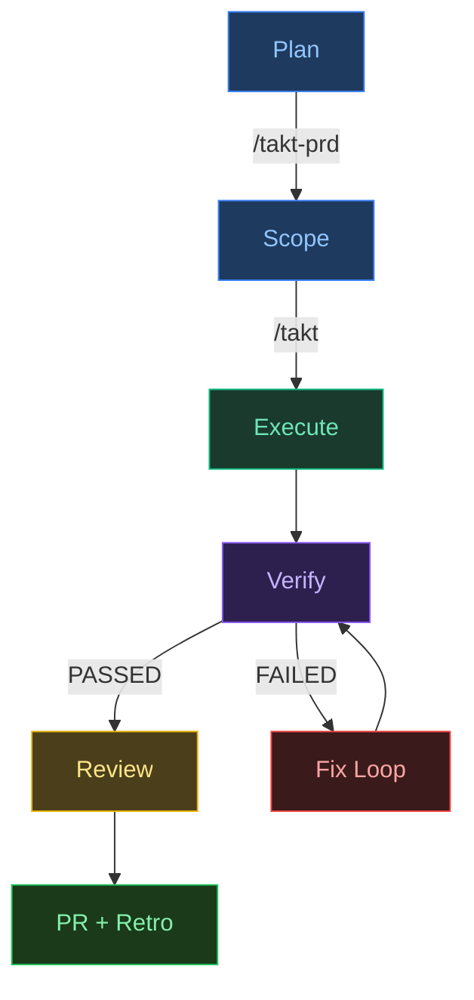
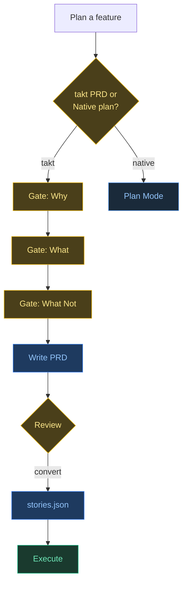
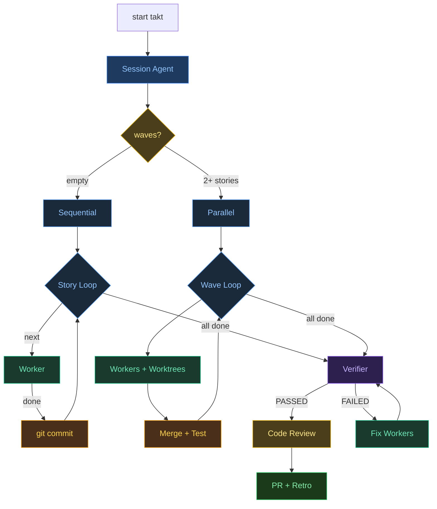

# takt

Enterprise-grade development workflows for AI agents. Four modes that mirror real agile delivery: sprint execution, parallel teams, structured debugging, and retrospectives — with hidden scenario-based verification that prevents agents from gaming their own tests.

Named after the Swedish/German word for "beat, pace, rhythm" — the same concept used in lean manufacturing and agile planning to set a sustainable delivery cadence. takt brings that discipline to autonomous AI development.

## Why takt?

Most AI coding tools treat development as a single prompt-response cycle. Real software delivery doesn't work that way. takt is built on patterns from orchestrating 50+ person programs across 10+ teams:

- **Stories, not prompts.** Work is scoped into user stories with acceptance criteria — the same artifact that drives human sprint planning.
- **Wave-based parallelism.** Dependencies are analyzed upfront, stories grouped into waves, and parallel agents execute within each wave — just like a real team coordinating across workstreams.
- **Fresh context per story.** Each story gets a clean agent instance, avoiding the context pollution that derails long sessions. Memory persists through git history, workbooks, and the PRD itself.
- **Hidden scenario verification.** An independent QA agent checks implementations against hidden BDD scenarios that workers never see — like a QA team that never shows developers what they're testing. Workers can't game the tests because they don't know the tests exist.
- **Verify-fix loops.** When verification fails, the system generates behavioral bug tickets (not scenario details) and spawns fresh workers to fix them. Up to 3 cycles, maintaining strict information isolation throughout.
- **Retrospectives that compound.** After each run, patterns are extracted from workbooks and tracked across executions. Recurring issues surface as alerts, not surprises.

## How It Works

takt runs natively inside Claude Code. There is no CLI binary or bash script — you interact with it by typing phrases in Claude Code.


```mermaid
graph TD
    A["Plan"] -- "/takt-prd" --> B["Scope"]
    B -- "/takt" --> C["Execute"]
    C --> D["Verify"]
    D -- "PASSED" --> E["Review"]
    D -- "FAILED" --> F["Fix Loop"]
    F --> D
    E --> G["PR + Retro"]

    style A fill:#1e3a5f,stroke:#3b82f6,color:#93c5fd
    style B fill:#1e3a5f,stroke:#3b82f6,color:#93c5fd
    style C fill:#1a3a2e,stroke:#10b981,color:#6ee7b7
    style D fill:#2d1f4e,stroke:#8b5cf6,color:#c4b5fd
    style E fill:#4a3f1a,stroke:#eab308,color:#fde68a
    style F fill:#3a1a1a,stroke:#ef4444,color:#fca5a5
    style G fill:#1a3a1a,stroke:#22c55e,color:#86efac
```

### Planning Flow

When planning a feature, takt intercepts plan mode to offer a structured PRD flow with gated checkpoints:


```mermaid
graph TD
    U["Plan a feature"] --> G{"takt PRD or\nNative plan?"}
    G -- "takt" --> W["Gate: Why"]
    G -- "native" --> NP["Plan Mode"]
    W --> WH["Gate: What"]
    WH --> WN["Gate: What Not"]
    WN --> P["Write PRD"]
    P --> R{"Review"}
    R -- "convert" --> T["stories.json"]
    T --> E["Execute"]

    style G fill:#4a3f1a,stroke:#eab308,color:#fde68a
    style W fill:#4a3f1a,stroke:#eab308,color:#fde68a
    style WH fill:#4a3f1a,stroke:#eab308,color:#fde68a
    style WN fill:#4a3f1a,stroke:#eab308,color:#fde68a
    style R fill:#4a3f1a,stroke:#eab308,color:#fde68a
    style P fill:#1e3a5f,stroke:#3b82f6,color:#93c5fd
    style T fill:#1e3a5f,stroke:#3b82f6,color:#93c5fd
    style E fill:#1a3a2e,stroke:#10b981,color:#6ee7b7
    style NP fill:#1a2a3a,stroke:#60a5fa,color:#93c5fd
```

1. **Plan** — Discuss the feature with Claude. Say "Create the PRD" and Claude generates a structured requirements document using `/takt-prd` with gated checkpoints (Why > What > What Not > Review).
2. **Scope** — Say "Convert to stories.json" and Claude converts the PRD into two files: `stories.json` (visible to workers) and `.takt/scenarios.json` (hidden BDD scenarios visible only to the verifier).
3. **Execute** — Say "start takt". The session agent reads `run.md`, auto-detects sequential vs parallel mode from the `waves` field, and orchestrates directly — spawning fresh worker agents for each story.
4. **Verify** — After all stories pass, an independent verifier checks the implementation against hidden scenarios. Failed scenarios become behavioral bug tickets. Fresh workers fix the bugs without seeing scenarios. Up to 3 verify-fix cycles.
5. **Review** — A code reviewer reads the feature branch diff (`.takt/review.diff`) and produces structured feedback. Must-fix issues trigger automated fix workers. Up to 2 review-fix cycles.
6. **Ship** — PR is created automatically, retro agent processes workbooks and updates `.takt/retro.md` and `CHANGELOG.md`.

## Information Isolation

takt enforces strict information boundaries between agents. This is the key architectural property that prevents workers from gaming verification.

```
/takt command (human reviews both files)
    |-- stories.json        -> session agent -> workers (implement features)
    +-- .takt/scenarios.json -> verifier ONLY (QA verification)
                                    |
                              100%? -> DONE
                              <100%?-> bugs.json -> fresh workers (fix)
                                                         |
                                                    re-verify (max 3 cycles)
```

| File | Session Agent | Worker | Verifier | Reviewer |
|------|--------------|--------|----------|----------|
| `stories.json` | reads + updates | never | never | never |
| `.takt/scenarios.json` | passes path only | **never** | reads | **never** |
| `bugs.json` | reads (routing) | never | writes | never |
| `.takt/review.diff` | writes (git diff) | never | never | reads |

**How it's enforced:**
- Workers have an explicit rule: "NEVER read files in `.takt/`"
- The session agent has an explicit rule: "NEVER read `.takt/scenarios.json` content — only pass the file path to the verifier"
- Bug tickets describe behaviors ("Form accepts empty email without validation error"), never scenario details ("SC-003 Given/When/Then failed")
- Each agent gets a fresh context (Ralph Wiggum pattern) — no information leaks between agent instances

This is prompt-level architectural isolation, not cryptographic enforcement. The same principle that makes human QA effective: devs don't see the test plan, so they build to the spec rather than to the tests.

## Modes

### start takt — Unified Execution

The session agent reads `stories.json`, auto-detects mode, and orchestrates directly. No intermediary orchestrator — the session agent IS the orchestrator.

**Mode auto-detection** from the `waves` field in stories.json:
- **Sequential** — `waves` is empty or missing: stories run in priority order, independent stories may run in parallel
- **Parallel** — any wave has 2+ stories: uses `TeamCreate` with `isolation: "worktree"` for parallel wave execution


```mermaid
graph TD
    U["start takt"] --> S["Session Agent"]
    S --> D{"waves?"}
    D -- "empty" --> SQ["Sequential"]
    D -- "2+ stories" --> PL["Parallel"]
    SQ --> L{"Story Loop"}
    PL --> WL{"Wave Loop"}
    L -- "next" --> W["Worker"]
    W -- "done" --> GC["git commit"]
    GC --> L
    WL --> WK["Workers + Worktrees"]
    WK --> MG["Merge + Test"]
    MG --> WL
    L -- "all done" --> SV["Verifier"]
    WL -- "all done" --> SV
    SV -- "PASSED" --> CR["Code Review"]
    SV -- "FAILED" --> FW["Fix Workers"]
    FW --> SV
    CR --> PR["PR + Retro"]

    style S fill:#1e3a5f,stroke:#3b82f6,color:#93c5fd
    style D fill:#4a3f1a,stroke:#eab308,color:#fde68a
    style SQ fill:#1a2a3a,stroke:#60a5fa,color:#93c5fd
    style PL fill:#1a2a3a,stroke:#60a5fa,color:#93c5fd
    style W fill:#1a3a2e,stroke:#10b981,color:#6ee7b7
    style WK fill:#1a3a2e,stroke:#10b981,color:#6ee7b7
    style FW fill:#1a3a2e,stroke:#10b981,color:#6ee7b7
    style GC fill:#4a2f1a,stroke:#f59e0b,color:#fcd34d
    style MG fill:#4a2f1a,stroke:#f59e0b,color:#fcd34d
    style SV fill:#2d1f4e,stroke:#8b5cf6,color:#c4b5fd
    style CR fill:#4a3f1a,stroke:#eab308,color:#fde68a
    style PR fill:#1a3a1a,stroke:#22c55e,color:#86efac
    style L fill:#1a2a3a,stroke:#60a5fa,color:#93c5fd
    style WL fill:#1a2a3a,stroke:#60a5fa,color:#93c5fd
```

Say in Claude Code:
```
start takt
```

**Key design properties:**
- **Session agent handles all git** — workers do file edits only (Read, Edit, Write, Glob, Grep). No Bash, no git, no sub-agent spawning.
- **Lean prompts** — worker prompts are under 1KB: story JSON + project path + "Read ~/.claude/lib/takt/worker.md for your instructions". No embedded instruction copies.
- **Diff file for review** — session agent writes `git diff main...HEAD > .takt/review.diff` before spawning the reviewer. Re-generated between review-fix cycles.
- **Direct implementation** — all story types use direct implementation. BDD scenarios (verified by an independent agent) are the quality gate, not TDD.

Deprecated aliases `takt solo` and `takt team` also work — they read the same `run.md`.

### takt debug — Incident Response

Strict bug-fixing discipline inspired by incident management: reproduce first, root cause second, minimal fix third, present evidence last. The agent must confirm the bug exists before touching any code. No unrelated changes allowed.

Say in Claude Code:
```
takt debug "Login fails on Safari"
```

Best for: bug fixing where discipline matters more than speed.

### takt retro — Continuous Improvement

Reads workbooks from a completed run and generates a retrospective entry in `.takt/retro.md`. Scans previous entries for recurring patterns and manages an alert lifecycle: `potential` -> `confirmed` -> `mitigated` -> `resolved`. Stale action items (carried 3+ times) auto-escalate to confirmed alerts.

Say in Claude Code:
```
takt retro
```

Triggered automatically after each run completes. The value of retros compounds over time — patterns that repeat across runs surface as confirmed alerts rather than rediscovered surprises.

## Artifacts

| File | Purpose | Created by | Visible to |
|------|---------|------------|------------|
| `stories.json` | Stories, waves, dependencies, verification modes | `/takt` command + human review | Session agent, workers |
| `.takt/scenarios.json` | Hidden BDD scenarios (Given/When/Then) for verification | `/takt` command + human review | Verifier only |
| `.takt/review.diff` | Unified diff for code review (ephemeral) | Session agent | Reviewer only |
| `bugs.json` | Behavioral bug tickets from failed scenarios | Verifier agent | Session agent, fix workers |
| `review-comments.json` | Structured review feedback | Reviewer agent | Session agent |
| `.takt/workbooks/workbook-US-XXX.md` | Per-story notes: decisions, files changed, blockers (ephemeral) | Each worker agent | Session agent |
| `.takt/retro.md` | Retrospective entries + active alerts | `takt retro` agent | Human |
| `tasks/prd-*.md` | Source PRD documents | `/takt-prd` command | Human |
| `tasks/archive/` | Completed PRDs, auto-archived on finish | Session agent | Human |

## Installation

```bash
git clone https://github.com/Sebstrdigital/takt.git
cd takt && ./install.sh
```

Everything installs into `~/.claude/`. The repo can be deleted after install.

### Updating

```bash
cd takt && git pull && ./install.sh
```

### What Gets Installed

```
~/.claude/
|-- lib/takt/
|   |-- run.md                # Unified orchestrator prompt (session-level)
|   |-- verifier.md           # Scenario verification + bug ticket agent
|   |-- reviewer.md           # Code review agent
|   |-- worker.md             # Worker agent prompt (file edits only)
|   |-- debug.md              # Debug mode agent prompt
|   +-- retro.md              # Retro mode agent prompt
|-- commands/
|   |-- takt.md               # /takt -- convert PRD to stories.json
|   |-- takt-prd.md           # /takt-prd -- generate PRD
|   +-- tdd.md                # /tdd -- TDD workflow
+-- CLAUDE.md                 # takt section appended
```

### Permission Setup

takt requires autonomous bash execution for git, jq, and gh commands. Workers already run with `bypassPermissions`, but the session agent (orchestrator) needs permission to run these commands without prompting.

**Option 1: Launch with skip-permissions (recommended for takt runs)**

```bash
claude --dangerously-skip-permissions
```

Start your Claude Code session with this flag before saying "start takt". All commands auto-approve.

**Option 2: Allowlist specific commands**

Add to your project's `.claude/settings.json`:

```json
{
  "permissions": {
    "allow": [
      "Bash(git *)",
      "Bash(git status)",
      "Bash(jq *)",
      "Bash(mkdir *)",
      "Bash(command *)",
      "Bash(gh *)"
    ]
  }
}
```

Requires a session restart to take effect.

## Prerequisites

- [Claude Code CLI](https://claude.com/claude-code) installed and authenticated
- A git repository for your project

## References

- [Geoffrey Huntley's Ralph pattern](https://ghuntley.com/ralph/) — the original autonomous agent loop concept that takt builds upon
- [Claude Code documentation](https://claude.com/claude-code)

## License

[MIT](LICENSE)
